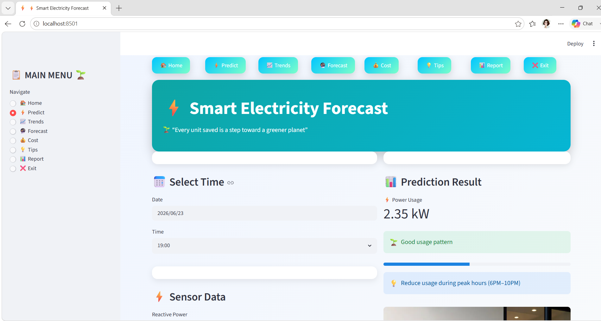
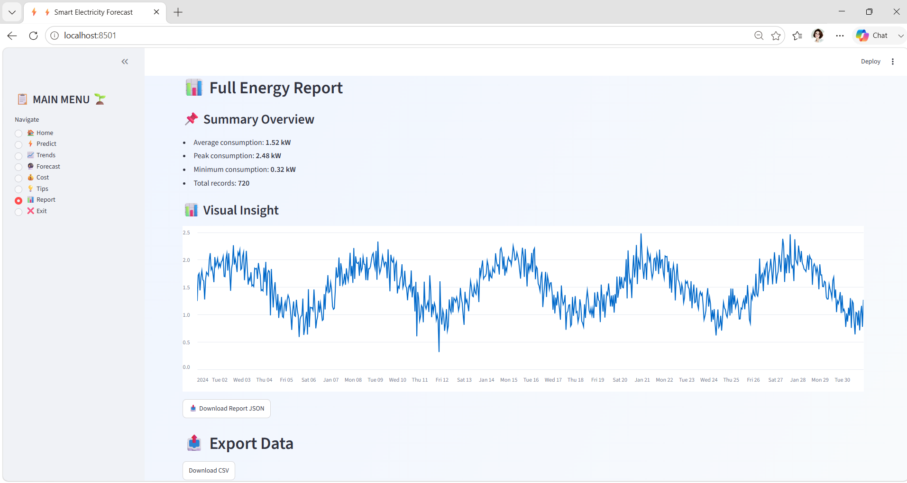

# ⚡ Household Electricity Forecasting System

## Private Machine Learning Project

A Machine Learning powered household electricity consumption forecasting system that predicts future electricity usage based on historical consumption patterns, electrical measurements, and time-based features.

The system combines:

- Machine Learning backend developed using Python and Google Colab
- Random Forest Regression forecasting model
- Streamlit interactive user interface developed using Visual Studio Code

---

# 📌 Project Overview

Electricity consumption changes depending on:

- Household activities
- Time of day
- Previous consumption behaviour
- Electrical parameters

This system analyzes electricity usage patterns and predicts the expected household power consumption.

The prediction is generated using:

- Previous electricity consumption history
- Sensor measurements
- Time information
- Engineered statistical features

---

# 🎯 Project Objectives

The objectives of this system are:

- Forecast household electricity consumption
- Provide a simple prediction interface
- Apply Machine Learning for energy monitoring
- Reduce manual electricity analysis
- Understand important electricity usage patterns

---

# 🧠 Machine Learning Model

## Algorithm Used

### Random Forest Regression

The system uses Random Forest because:

- Handles complex non-linear relationships
- Works well with multiple input variables
- Provides reliable predictions
- Supports feature importance analysis

---

# 🔍 Feature Engineering

The model uses several categories of features.

## Time-Based Features

Includes:

- Hour
- Day of week
- Month
- Day of month
- Week number
- Weekend detection
- Night time detection
- Morning peak
- Evening peak

---

## Cyclic Time Encoding

Time values are transformed into repeating patterns:

- Hour sine
- Hour cosine
- Day sine
- Day cosine
- Month sine
- Month cosine

This helps the model understand daily and seasonal behaviour.

---

## Historical Consumption Features

Previous electricity usage values:

- Lag 1 hour
- Lag 2 hours
- Lag 3 hours
- Lag 24 hours
- Lag 7 days

Rolling statistics:

- 3 hour average
- 6 hour average
- 12 hour average
- 24 hour average
- 7 day average

---

## Electrical Input Features

The model uses:

- Global Active Power
- Global Reactive Power
- Voltage
- Global Intensity
- Sub Metering 1
- Sub Metering 2
- Sub Metering 3

---

# 🚫 Data Leakage Prevention

The forecasting pipeline prevents target leakage by:

- Creating lag features using shifted historical values
- Calculating rolling statistics only from previous data
- Avoiding future information during prediction

This allows the model to work with real prediction inputs.

---

# 🏗 System Architecture

```
User

 ↓

Streamlit Web Interface

 ↓

Input Processing

 ↓

Feature Engineering

 ↓

Scaler

 ↓

Random Forest Model

 ↓

Electricity Consumption Prediction

```

---

# 🖥 User Interface (Streamlit)

The frontend application was developed using:

## Streamlit

The UI allows users to interact with the forecasting system without running the ML code manually.

Users can:

- Enter electricity measurements
- Provide historical consumption values
- Select time-related inputs
- Generate predictions

---

# 📸 User Interface Screenshots

## Home / Input Page

Add your Streamlit main page screenshot here:

```
screenshots/ui_home.png
```




---

## Prediction Result Page

Add your prediction output screenshot here:

```
screenshots/prediction_result.png
```




---

# ✨ UI Features

## Input Panel

The user can provide:

- Voltage
- Global intensity
- Reactive power
- Sub-meter readings
- Previous power values
- Time information

---

## Prediction Process

The application:

1. Receives user input
2. Creates required ML features
3. Loads trained model
4. Applies preprocessing
5. Generates electricity forecast

---

## Output

The application displays:

- Predicted electricity consumption
- Forecast value in kW
- Energy usage estimation

---

# 🛠 Technology Stack

## Programming

- Python

## Machine Learning

- Scikit-learn
- Random Forest Regression

## Data Processing

- Pandas
- NumPy

## Visualization

- Matplotlib
- Seaborn

## Frontend

- Streamlit

## Development Tools

- Google Colab
- Visual Studio Code

---

# 📂 Project Structure

```
Household-Electricity-Forecasting/

│
├── app.py
│     Streamlit UI application
│
├── models/
│
│   ├── random_forest_model.pkl
│   ├── scaler.pkl
│   └── feature.pkl
│
├── data/
│
│   ├── raw/
│   │     household_power_consumption.csv
│   │
│   └── processed/
│         cleaned_dataset.csv
│         features_dataset.csv
│
├── notebooks/
│
│   └── electricity_forecasting.ipynb
│
├── screenshots/
│
│   ├── ui_home.png
│   └── prediction_result.png
│
├── requirements.txt
│
└── README.md

```

---

# ⚙ Installation

## Install dependencies

```
pip install -r requirements.txt
```

---

# ▶ Run Application

Run Streamlit:

```
streamlit run app.py
```

The application will open in your browser.

---

# 🔄 System Workflow

```
Electricity Dataset

        ↓

Data Cleaning

        ↓

Feature Engineering

        ↓

Feature Scaling

        ↓

Random Forest Training

        ↓

Saved Model Files

        ↓

Streamlit Interface

        ↓

Prediction Output

```

---

# 📊 Model Evaluation

The model performance is measured using:

## MAE

Mean Absolute Error

Shows average prediction difference.

---

## RMSE

Root Mean Square Error

Measures prediction error magnitude.

---

## R² Score

Shows how well the model explains electricity patterns.

---

# 🔐 Project Privacy

This is a private project.

The source code, trained models, datasets, and UI implementation are maintained privately.

---

# 🚀 Future Improvements

Future upgrades:

- Real-time smart meter integration
- IoT sensor connection
- Cloud deployment
- Mobile application
- Energy saving recommendations
- Deep learning forecasting models
- User authentication

---

# 👨‍💻 Developed By

>>> Private Project >>> Machine Learning + Streamlit Application Built ❤️ by <a href="https://github.com/IleeshaUdari"><strong>M.G.Ileesha Udari Sasmitha</strong></a>
